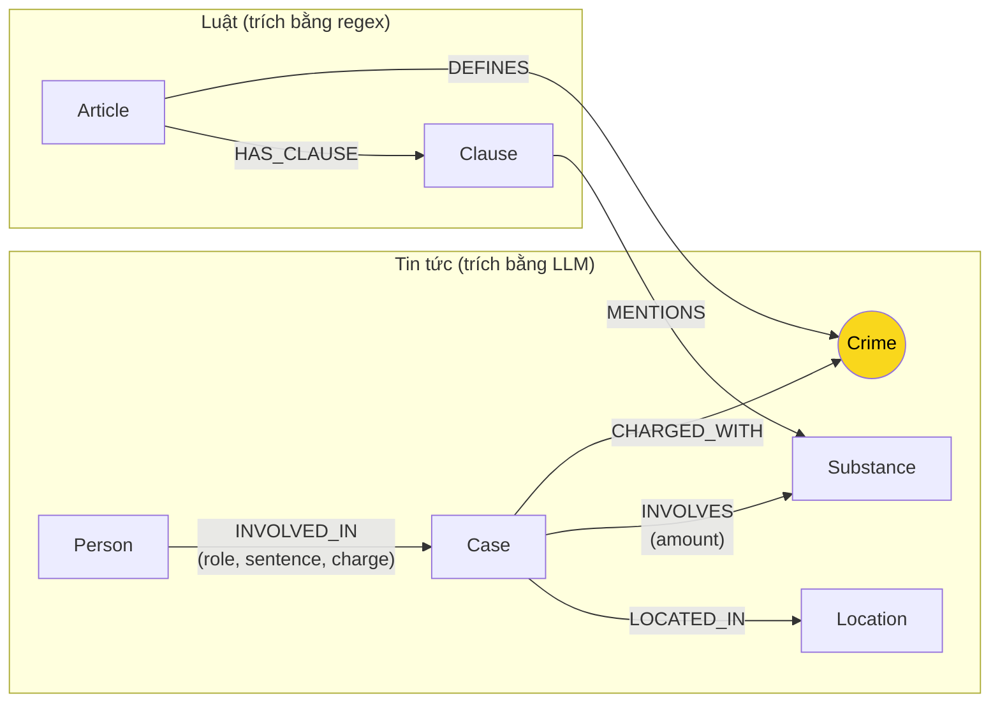

# Thiết kế Ontology — Day 19

**Họ tên:** Vũ Hải Đăng  **MSSV:** 2A202602821

**Lựa chọn** (đánh dấu một):
- [x] Dùng ontology gợi ý (có thể chỉnh nhỏ)
- [ ] Tự thiết kế (xét bonus +15, xem `SUBMISSION.md`)

> Hướng dẫn: `LAB_GUIDE.md` Bước 2. Dùng ontology gợi ý thì vẫn phải điền đủ các mục dưới đây bằng lời của bạn.

## 1. Sơ đồ

**Node cầu nối:** `Crime` (màu vàng) — kết nối KB luật (Điều luật định nghĩa tội) với KB tin tức (vụ án bị truy tố tội đó).

## 2. Entity types (node labels)

| Label | Ý nghĩa | Khóa định danh (`MERGE` theo) | Properties | Lấy từ KB nào | Trích bằng (regex / LLM / khác) |
| --- | --- | --- | --- | --- | --- |
| `Article` | Điều luật BLHS/PCMT | `id` ("Điều 251 BLHS") | title, law, doc_id | Luật | Regex (parse_law_article) |
| `Clause` | Khoản trong Điều | `id` ("Điều 251 BLHS khoản 1") | number, penalty, text, doc_id | Luật | Regex (parse_law_article) |
| `Crime` | Tội danh | `name` (chuẩn hóa) | - | Luật (từ tiêu đề Điều) | Regex + normalize_crime |
| `Case` | Vụ án | `name` (do LLM đặt) | name, summary, date, doc_id, source_title | Tin tức | LLM (extract_news_cases) |
| `Person` | Người liên quan | `name` | name, aliases | Tin tức | LLM (extract_news_cases) |
| `Substance` | Chất ma túy | `name` | - | Cả hai | Regex (luật) + LLM (tin) |
| `Location` | Địa điểm | `name` | - | Tin tức | LLM (extract_news_cases) |

## 3. Relationships

| Type | Từ → Đến | Properties trên cạnh | Ý nghĩa |
| --- | --- | --- | --- |
| `DEFINES` | Article → Crime | - | Điều luật định nghĩa tội danh |
| `HAS_CLAUSE` | Article → Clause | - | Điều có các khoản |
| `MENTIONS` | Clause → Substance | - | Khoản nêu chất ma túy cụ thể |
| `CHARGED_WITH` | Case → Crime | - | Vụ án bị truy tố tội danh này |
| `INVOLVES` | Case → Substance | amount | Vụ liên quan chất với khối lượng |
| `LOCATED_IN` | Case → Location | - | Vụ xảy ra tại địa điểm |
| `INVOLVED_IN` | Person → Case | role, sentence, charge | Người tham gia vụ với vai trò |

## 4. Node cầu nối giữa 2 KB

- **Node nào:** `Crime` (tội danh)
- **Vì sao chọn node này:** Tội danh là thông tin **bắt buộc** có trong cả hai KB:
  - KB Luật: mỗi Điều có tiêu đề "Tội ..." → trích bằng regex
  - KB Tin: báo viết tội danh bị cáo → trích bằng LLM
  - Khi khớp được tội danh → có thể đi từ vụ án sang Điều luật tương ứng

- **Cách đảm bảo hai phía khớp tên:**
  1. `normalize_crime()` chuẩn hóa: bỏ "Tội ", lowercase, bỏ dấu câu
  2. `link_entity()` khớp fuzzy với cutoff=0.8 (dùng difflib)
  3. Đưa danh sách tên chuẩn vào prompt LLM để gợi ý

- **Khi nào cầu gãy, và bạn xử lý thế nào:**
  - Tội danh mới chưa có trong luật → không nối được, chấp nhận
  - Tên tội trong tin khác quá nhiều so với luật (difflib < 0.8) → trả về None, không nối sai
  - LLM đặt tên Case/Person không ổn định → dùng `name` làm khóa, có thể trùng

## 5. Competency questions

| Câu | Đường đi (Cypher pattern) | Trả lời được? |
| --- | --- | --- |
| Q1 | Q1 hỏi về tiền chất trong Luật PCMT → chỉ cần vector search trong KB luật, không cần graph | Chỉ dùng Flat RAG đủ |
| Q2 | Case → Person (INVOLVED_IN) → lọc sentence = "tử hình" | Có (nhưng có thể thiếu nếu LLM không trích được) |
| Q3 | Person → Case → Crime → Article → Clause (khoản 1) | Có ✅ |
| Q4 | Person → Case → Crime → Article → Clause (khoản max) | Có ✅ |
| Q5 | Person → Case → Substance (MDMA) → Crime → Article → Clause phù hợp với khối lượng | Có ✅ |
| Q6 | Case → Substance (MDMA) → Case | Có ✅ |

## 6. Quyết định thiết kế và đánh đổi

**1. Khoản là node hay property?**
- **Chọn:** Là **node** (`Clause`)
- **Phương án khác:** Là property của Article (chuỗi text)
- **Lý do:** Mỗi khoản có số, penalty, text riêng; cần query riêng được. Là node thì có thể `MENTIONS` Substance riêng.

**2. Substance là node dùng chung hay property?**
- **Chọn:** Là **node** dùng chung giữa 2 KB
- **Phương án khác:** Tách Substance luật và Substance tin riêng
- **Lý do:** Cùng một chất (VD: MDMA) xuất hiện cả 2 KB; dùng node chung thì query "khoản nào nêu MDMA" dùng được cho cả 2.

**3. Khóa định danh cho Case/Person?**
- **Chọn:** `name` (do LLM đặt)
- **Phương án khác:** Sinh ID từ hàm hash, hoặc dùng nhiều property kết hợp
- **Lý do:** Đơn giản, LLM đặt tên có ý nghĩa cho người đọc. **Nhược điểm:** LLM mỗi lần gọi có thể đặt tên khác → trùng node không gộp được.

## 7. So với ontology gợi ý (bắt buộc nếu xét bonus)

*Đang dùng ontology gợi ý, không có điểm khác.*

## 8. Hạn chế còn lại

1. **Trùng thực thể:** Case/Person dùng `name` do LLM đặt → mỗi lần gọi LLM có thể tạo node mới thay vì gộp
2. **Chuẩn hóa Substance:** Không gộp được tên đồng nghĩa (VD: "ma túy đá" vs "Methamphetamine")
3. **Ngưỡng khối lượng:** Ontology không mô hình hóa ngưỡng (VD: bao nhiêu gam thì thuộc khoản nào)
4. **Giai đoạn tố tụng:** Không phân biệt bắt/khởi tố/xét xử/phúc thẩm
